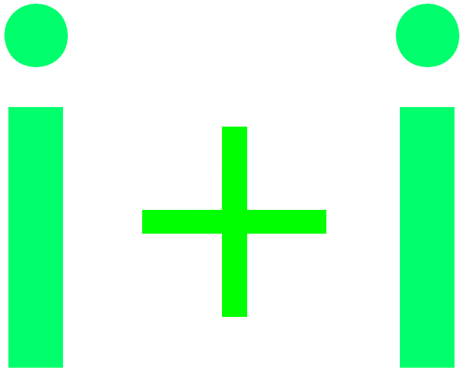

# &nbsp;&nbsp;&nbsp;&nbsp;Grouping-optimization

This website is intended to achieve the fairest group division, increasing social interests by improving overall satisfaction of group mates.
## Pictures

Signing up  

 Class members could input their preferences 

 Class owners could customize optimization methods 

 An example of the output 

## Features
An account is needed to work with the algorithms of the web application.
- Users can register accounts. In every account, user can join a classroom or create a new one. 
- Classrooms are intended for the class owner (the class creator) to select the favorite algorithm to generate optimized groups. There is an algorithm is faster for smaller classes (less than 12 people), and the other that is generally slower but capable of handling larger classes.
- Everyone except the class owner have the interface to provide information of their favorites as well as someone they do not like much. The information is designed not be exposed to anyone within and outside the classroom. Only the person holding the information can view it.
- The web application supports both English and Traditional Chinese.

## Algorithms
The web application actually includes only Combination Selection Grouping and Regression Algorithm, but three algorithms were developed just in case if they are useful.

### 1. Combination Selection Grouping
1. The possible outcome of a single groups are generated using itertools library.
2. Using a recursive function, compute the possible outcomes of other groups to form nCr cases, which n is the number of people in total, and r is the group size.
3. A dictionary of people favorism are used to compute the overall happiness of each group. For every groupmates, if one favored person in the same group, the overall happiness index will plus 1. On the other hand, if one unfavored person in the same group, the overall happiness index will minus 1.
4. The happiness calculation will run in every groups in every cases
5. The score of least happy groups will be collected as a list, where each element represent the least happy group of each case.
6. The cases with highest least happy score will be selected to be the output.

### 2. Regression Algorithm
1. The program generates the groups randomly
2. The program calculates the most unhappy group, and change the member from the group with other groups randomly. The happiness calculation algorithm is the same as that of Combination Selection Grouping
3. If the score of the most unhappy group exceeds the record, then set it as the current record. If the program cannot beat the record with a fixed attempts, the program will return the record.

## Performance
### Complexity for Combination Selection Grouping:
n represents the total number of people, r represents the group size, and x represents a positive integer.
 
### $${n-1 \choose r-1} \cdot {n-r-1 \choose r-1} \cdot {n-2r-1 \choose r-1}...;n-xr-1 \geq r-1$$
The complexity grows factorially. Therefore, it is not suitable to group a class with more than 12 people.

### Complexity for Regression Algorithm:
Maximum complexity:  
### $$depth * attempts$$ 
whereas depth is set fixed to 100 and maximum attempts is set fixed to 100000. 
Therefore, it is more usable when grouping large classes.

